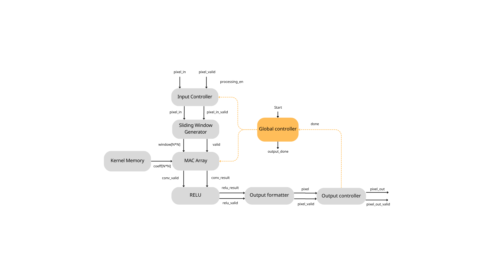
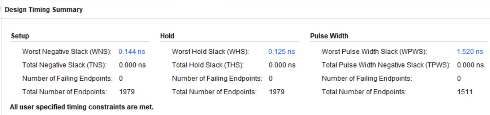
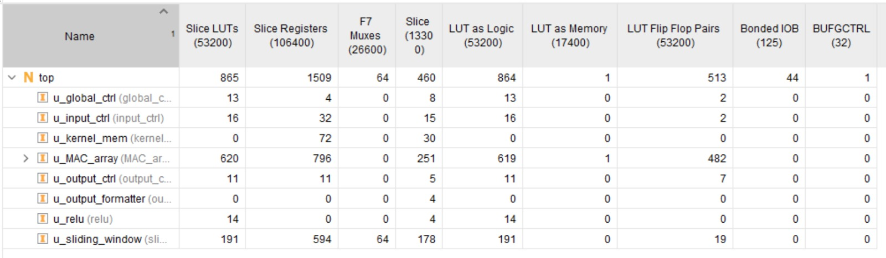
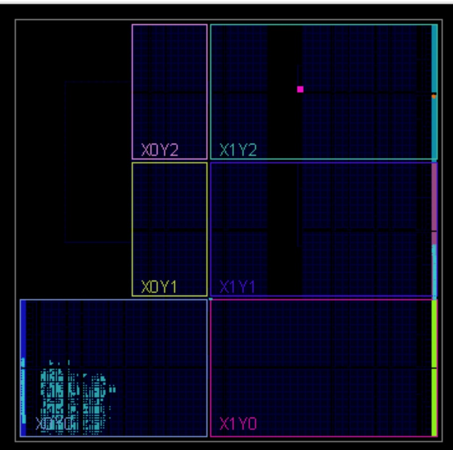
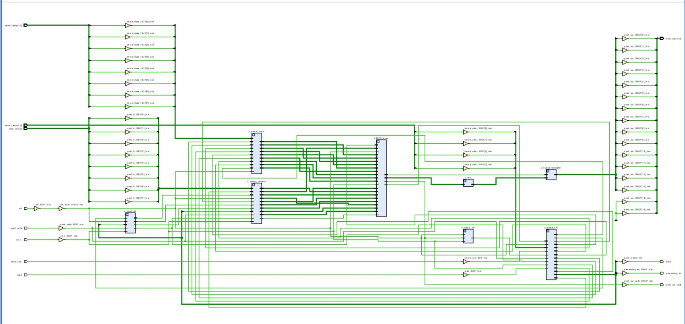
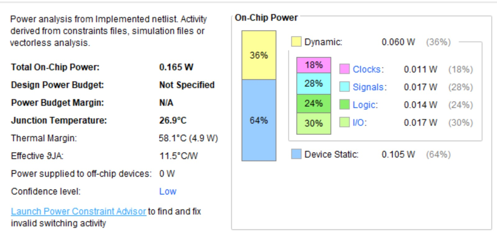

# FPGA-Based Edge-AI Vision Accelerator


Streaming **3x3 valid convolution (stride 1) accelerator**: `sliding-window -> MAC array (9x DSP) -> ReLU -> round/shift/saturate formatter`, wrapped in a control-FSM + streaming interface.

**Timing-closed at 200 MHz on PYNQ-Z2 (`xc7z020-1clg400c`)** with only **865 LUTs / 1509 FFs / 9 DSPs / 0 BRAM** and **0.165 W**. Verified with a **UVM environment against a Python golden model** (identity / blur / random / multi-random, per-frame exact match).

> Full interactive report: [`docs/report.html`](docs/report.html)

## Table of Contents

- [Key Specs](#key-specs)
- [Features](#features)
- [Architecture](#architecture)
- [Fixed-Point Format](#fixed-point-format--parameters)
- [Repo Layout](#repo-layout)
- [Requirements](#requirements)
- [Running the UVM Regression](#running-the-uvm-regression)
- [Running the Plain Smoke Test](#running-the-plain-smoke-test)
- [Python Golden Model](#python-golden-model-stand-alone)
- [FPGA Implementation](#fpga-implementation-vivado-20182)
- [Implementation Results](#implementation-results-vivado-implemented-200-mhz)
- [Verification Strategy](#verification-strategy)

## Key Specs

| Item | Value |
|------|-------|
| Function | 3x3 valid conv, stride 1, 32x32 -> 30x30 per frame |
| Throughput (steady state) | **1 window / 1 output pixel / clock** |
| Clock | **200 MHz** (`create_clock -period 5.000`, `RTL/constraints.xdc`) |
| Device | PYNQ-Z2, `xc7z020-1clg400c` |
| Resources (implemented) | **865 LUTs (1.63%) / 1509 FFs (1.42%) / 460 slices / 9 DSPs / 0 BRAM** |
| Timing | **WNS +0.144 ns / WHS +0.125 ns / WPWS +1.520 ns, 0 failing -> Fmax ~206 MHz** |
| Power | **0.165 W total** (0.060 W dynamic + 0.105 W static, Tj 26.9 C) |
| FoM `Throughput/(Power*(LUT+50*DSP+100*BRAM))` | **0.00461** = `1/(0.165*(865+50*9))` |
| RTL entry point | `RTL/CNN_accelerator.sv` (package + all modules, `top` last) |
| Simulators | QuestaSim/ModelSim + UVM 1.2, Python 3 golden model |
| Vivado project | `VIVADO/VIVADO.xpr` (Vivado 2018.2) |

## Features

- **True streaming datapath** - no frame buffer, no BRAM. 2 line-buffers + 3x3 regs sustain 1 px/clk.
- **9x DSP MAC array** - Vivado `mult_gen_0` multipliers + 2-stage pipelined adder tree for 200 MHz.
- **Runtime-programmable kernel** - 9x 8-bit weights via `kernel_we/addr/data` when idle, held locally in MAC.
- **Fused ReLU + formatter** - combinational ReLU + round-bias + shift + signed-16 saturate, zero extra cycles.
- **Lightweight control** - `global_ctrl` FSM `IDLE -> PROCESSING -> DONE -> IDLE`; input/output controllers track rows/cols.
- **Fully parameterized** - image size, `K_DIM`, widths, frac bits, shift/round/ReLU all in `RTL/conv_pkg.sv`.
- **UVM-verified** - driver/monitor/agent/scoreboard, `+N_FRAMES`, `+PY`, `+UVM_TESTNAME` plusargs, exact-match checker.

## Architecture



### Datapath (1 window / 1 output per clock steady-state)

```text
pixel_in -> input_ctrl -> sliding_window (2x32 line buffers + 3x3 regs)
         -> MAC_array (9x mult_gen_0 + row sums + frame sum, pipelined)
         -> relu (combinational) -> output_formatter (round -> >>> SHIFT -> saturate)
         -> output_ctrl -> pixel_out
```

Kernel path: `kernel_we/addr/data -> kernel_mem (9x8b) -> kernel_coeffs[9] -> MAC_array (latched when idle)`.
Control: `global_ctrl` FSM `IDLE --start--> PROCESSING --output_done--> DONE --> IDLE` (config + kernel preserved for restart; kernel writes ignored while `processing_en == 1`).

### Module Map (`top.sv` instance names match utilization report)

| Instance | File | Function |
|----------|------|----------|
| `u_global_ctrl` | `RTL/global_ctrl.sv` | 3-state FSM, `processing_en`/`done` |
| `u_input_ctrl` | `RTL/input_ctrl.sv` | stream gate + 32x32 row/col counters, `end_of_row/frame` |
| `u_kernel_mem` | `RTL/kernel_mem.sv` | 9x8-bit kernel regfile, combinational readout |
| `u_sliding_window` | `RTL/sliding_window.sv` | 2 line buffers (circular `ptr`) + 3x3 shift window, `window_valid` |
| `u_MAC_array` | `RTL/MAC_array.sv` | 9x `mult_gen_0` DSP + product regs + row/frame sums (pipelined) |
| `u_relu` | `RTL/relu.sv` | `RELU_EN ? (neg->0) : passthrough` |
| `u_output_formatter` | `RTL/output_formatter.sv` | sign-extend -> round-bias -> `>>> SHIFT_AMT` -> saturate to int16 |
| `u_output_ctrl` | `RTL/output_controller.sv` (`module output_ctrl`) | 30x30 counter, `done` on last pixel |
| `top` | `RTL/top.sv` | integration |
| `processing_element.sv` | `RTL/processing_element.sv` | behavioral `pixel*coeff` reference (impl uses DSP IP) |

Top-level `top` ports: `clk/rst_n`, `start/done/processing_en`, `kernel_we/addr[3:0]/data[7:0]`, `pixel_in[7:0]/pixel_valid` (Q8.0 unsigned, 1 px/clk), `pixel_out[15:0]/pixel_out_valid` (signed-16, 900 px/frame = 30x30).

### RTL Deep Dive (file-by-file, matches `RTL/`)

**`conv_pkg.sv` — single source of truth.** `IMG_MAX 32x32`, `K_DIM 3`, `PIX 8b U`, `WGT 8b S Q1.6`, `OUT 16b S`, `PROD_W 16`, `PARTIAL_W 18`, `ACC_W 20`, `OUT_F 30x30`, `RELU_EN/ROUND_EN 1`, `SHIFT_AMT 6`. `UVM/pkg/shared_pkg.sv` mirrors every field so TB and DUT can never drift.

**`global_ctrl.sv` — 3-state Mealy/Moore FSM.** `IDLE (en 0/done 0) --start--> PROCESSING (en 1) --output_done--> DONE (done 1 for 1 clk) --> IDLE`. Async-feel sync `rst_n`. Kernel + config survive restart; `processing_en` gates `input_ctrl` and `kernel_mem` writes.

**`input_ctrl.sv` — stream gate + counters.** `accept = processing_en && pixel_valid`; `pixel_out = pixel_in` (zero-latency passthrough). 16-bit `row_cnt/col_cnt` vs `IMG_MAX_W/H`; `end_of_row = (col==31)`, `end_of_frame = (row==31 && eor)`. Counters clear when `!processing_en`. Feeds `sliding_window` its `end_of_row/frame` framing.

**`kernel_mem.sv` — 9x8b regfile.** `kernel_mem[0:8]`, written only when `!processing_en && kernel_we && rst_n` at `kernel_addr[3:0]`. Combinational fanout `kernel_coeff[i] = kernel_mem[i]` to MAC. No reset init needed — programmed while idle before each `start`.

**`sliding_window.sv` — the streaming heart, 0 BRAM.** `lb[0:1][0:31]` = 2 line buffers (FF/distributed RAM, hence 191 LUT / 594 FF), circular `ptr[$clog2(32)]`, `win[3][3]` shift registers, `rows_filled/cols_filled[$clog2(3)]`. Each `pixel_valid`: shift every row left, inject `right_col_src` (live pixel for bottom row, `lb_read` for upper rows), push `pixel_in -> lb[0][ptr]`, cascade `lb[1] <= lb[0]_read`. `ptr++` per pixel, reset on `end_of_row`; `rows_filled++` per row, `cols_filled++` per col. `window_valid = (rows==2 && cols==2)` — first valid window appears exactly when the 3rd row / 3rd col fills, then 1 window/clk steady-state (900/frame). Flattened `window[r*3+c] = win[r][c]` to MAC.

**`MAC_array.sv` — 9x DSP + 2-stage adder pipe (620 LUT / 796 FF).** `kernel_coeff_local[9]` snapshots `kernel_coeffs` while `!processing_en` so weights are rock-solid during frame. 9x `mult_gen_0` (8Ux8S->16S, `IP_LATENCY 1`, maps to 9 DSP48) → `product[9]` → `product_reg[9]` + `ip_valid_pipe` (stage 1) → combinational `row_sum[3]` (3 adds each) → `row_sum_reg[3]` (stage 2) → combinational `sum_comb` (2 adds) → `conv_result/conv_valid` (stage 3). Valid pipeline `window_valid -> window_valid_reg -> conv_valid_reg -> conv_valid` stays bit-aligned with data. `relu/valid` downstream is pure passthrough timing-wise.

**`relu.sv` — 1 line, 14 LUT.** `relu_result = (RELU_EN && conv_result[MSB]) ? 0 : conv_result`. `relu_valid = conv_valid`. Disable via `RELU_EN 0` for raw signed conv (needed for negative-kernel debug).

**`output_formatter.sv` — 0 LUT/FF (pure routing + auto-saturate).** `CALC_W 32`: `extended = relu_result` → `biased = extended + (1<<(SHIFT-1))` iff `ROUND_EN && SHIFT!=0` → `scaled = biased >>> SHIFT` (arithmetic) → clamp to `[-32768,+32767]` else `scaled[15:0]`. Bit-exact vs `golden_model.py` integer ops.

**`output_controller.sv` (`module output_ctrl`) — frame counter + `done`.** 5-bit `row_cnt/col_cnt` vs `OUT_F 30`; `end_of_row = (col==29)`, `last = (row==29 && eor)`. On each `pixel_valid`: `done <= last`, advance/wrap counters. `done` is a 1-clk pulse consumed by `global_ctrl.output_done`. `pixel_out(_valid)` is passthrough — no backpressure, consumer must keep up.

**`top.sv` — structural glue only.** Declares `ctrl_pixel_out/valid`, `window[9]/window_valid`, `kernel_coeffs[9]`, `conv/relu/fmt result+valid`, `output_done`; instantiates the 8 blocks above in datapath order. No logic to close timing on.

**`CNN_accelerator.sv` — compile entry.** Ordered `` `include ``s (`conv_pkg` → memories/ctrl → window → PE → MAC → formatter → relu → output_ctrl → `top` last) so a single `vlog -sv -f files.f` compiles cleanly in Questa and Vivado.

**`processing_element.sv` — behavioral reference only** (`$signed({1'b0,pixel})*coeff`). Kept for docs/sim; the implemented netlist uses `mult_gen_0` DSP IP instead.

**`constraints.xdc` — 200 MHz only.** PYNQ-Z2 `PACKAGE_PIN H16 LVCMOS33` + `create_clock -period 5.000`. No false paths needed — fully synchronous single-clock design.


## Fixed-Point Format & Parameters

All in `RTL/conv_pkg.sv` (mirrored in `UVM/pkg/shared_pkg.sv` and `golden_model.py` args):

| Signal | Format |
|--------|--------|
| pixel (input) | Q8.0 unsigned (`PIX_WIDTH=8`, `PIX_FRAC=0`) |
| kernel weight | Q1.6 signed (`WGT_WIDTH=8`, `WGT_FRAC=6`; `1.0 = 64`) |
| product | `PROD_W=16`, frac `PROD_FRAC=6` |
| accumulator | `ACC_W=20` (row + frame sums) |
| output | signed 16-bit after round + `>>> SHIFT_AMT` + saturate (`OUT_W=16`) |

```systemverilog
parameter int IMG_MAX_W = 32, IMG_MAX_H = 32, K_DIM = 3;
parameter int PIX_WIDTH = 8,  WGT_WIDTH = 8, OUT_W = 16;
parameter int PIX_FRAC = 0,   WGT_FRAC = 6,  PROD_FRAC = PIX_FRAC + WGT_FRAC;
parameter int OUT_F_W = IMG_MAX_W - K_DIM + 1; // 30
parameter int OUT_F_H = IMG_MAX_H - K_DIM + 1; // 30
parameter bit RELU_EN = 1, ROUND_EN = 1;
parameter int SHIFT_AMT = PROD_FRAC; // 6
```

Rounding: `biased = extended + (1 << (SHIFT-1))` when `ROUND_EN && SHIFT!=0`, then `scaled = biased >>> SHIFT`, clamp to `[-32768,+32767]`. Python model does identical integer ops.
## Repo Layout

```text
RTL/ : CNN_accelerator.sv (entry), conv_pkg.sv, top.sv,
  global_ctrl.sv, input_ctrl.sv, kernel_mem.sv,
  sliding_window.sv, MAC_array.sv, processing_element.sv (ref),
  relu.sv, output_formatter.sv, output_controller.sv, constraints.xdc
UVM/ : top_uvm.sv, pkg/, env/conv_env.sv, env/agent/ (if, item,
  driver, monitor, sequencer, agent, cfg),
  env/scoreboard/ (conv_scoreboard.sv, golden_model.py),
  sequences/ (reset, base, identity, blur, random),
  tests/ (base, identity, blur, random, multi_random N=10)
sim/ : run.do / files.f (UVM), basic_run.do / basic_files.f / tb_top.sv (smoke)
VIVADO/VIVADO.xpr : Vivado 2018.2 project (mult_gen_0/1 IPs)
docs/ : report.html, block_diagram.png, timing/utilization/power/device/synth shots
```

## Requirements

- QuestaSim / ModelSim + UVM 1.2 (2021.1 used here).
- Python 3 as `python` (or `+PY=python3`). Pure stdlib.
- (Optional) Vivado 2018.2 for `VIVADO/VIVADO.xpr`.

## Running the UVM Regression

```tcl
cd sim
vsim -c -do run.do            ; # batch: compile + run + SAIF
vsim -do run.do               ; # GUI with waves
```

```tcl
vsim -c -do run.do +UVM_TESTNAME=conv_identity_test +UVM_VERBOSITY=UVM_LOW
vsim -c -do run.do +UVM_TESTNAME=conv_blur_test
vsim -c -do run.do +UVM_TESTNAME=conv_random_test
vsim -c -do run.do +UVM_TESTNAME=conv_multi_random_test +N_FRAMES=3
vsim -c -do run.do +PY=python3
```

`run.do`: `vdel/vlib/vlog -sv -f files.f`, copies `golden_model.py` to sim,
runs `work.tb_top_uvm`, `power report -bsaif my_design.saif`, waves per `u_*`.
Scoreboard writes `kernel_N.hex`/`image_N.hex`, calls Python for `expected_N.hex`,
exact-match compare (`SUMMARY frames=.. pass=.. fail=..`).

## Running the Plain Smoke Test

```tcl
cd sim
vsim -do basic_run.do
```

32x32 ramp + identity kernel, waits for `done`, `$stop` with waves.

## Python Golden Model (stand-alone)

```bash
python UVM/env/scoreboard/golden_model.py --kernel kernel.hex --image image.hex --out expected.hex --k 3 --img-h 32 --img-w 32 --shift 6 --round 1 --relu 1
```

kernel.hex: 9 lines 8b hex (2s comp, row-major). image.hex: 1024 lines 8b hex.
expected.hex: 900 lines 16b hex (2s comp, row-major).

## FPGA Implementation (Vivado 2018.2)

1. Open `VIVADO/VIVADO.xpr` (products regenerate on open).
2. Sources: `RTL/*` + `mult_gen_0` (8x8->16b, 1-cycle) in `VIVADO.srcs/sources_1/ip/`.
3. Constraints `RTL/constraints.xdc`:
```tcl
set_property -dict {PACKAGE_PIN H16 IOSTANDARD LVCMOS33} [get_ports clk]
create_clock -name sys_clk -period 5.000 [get_ports clk]
```
4. `Run Synthesis -> Run Implementation -> Generate Bitstream` (xc7z020-1clg400c).

## Implementation Results (Vivado Implemented, 200 MHz)



| Metric | Value | Failing / Total |
|--------|-------|-----------------|
| WNS / TNS | **+0.144 ns** / 0.000 ns | 0 / 1979 |
| WHS / THS | **+0.125 ns** / 0.000 ns | 0 / 1979 |
| WPWS / TPWS | **+1.520 ns** / 0.000 ns | 0 / 1511 |

Fmax ~ `1/(5.000-0.144)` = **~206 MHz**. All MET.



| Module | LUT | FF | Slice |
|--------|-----|----|-------|
| u_MAC_array | 620 | 796 | 251 |
| u_sliding_window | 191 | 594 | 178 |
| u_kernel_mem | 0 | 72 | 30 |
| u_input_ctrl | 16 | 32 | 15 |
| u_global_ctrl | 13 | 4 | 8 |
| u_output_ctrl | 11 | 11 | 5 |
| u_relu | 14 | 0 | 4 |
| u_output_formatter | 0 | 0 | 4 |
| **top** | **865 / 53200 (1.63%)** | **1509 / 106400 (1.42%)** | **460** |

DSP **9**, BRAM **0**.





Total **0.165 W** (Dyn 0.060 / Static 0.105). Clk 0.011, Sig 0.017, Logic 0.014, I/O 0.017 W. Tj 26.9 C (SAIF `sim/my_design.saif`).

**FoM = Throughput/(Power x (LUT+50xDSP+100xBRAM))** = `1/(0.165x(865+50x9))` = **0.00461**.

## Verification Strategy

| Layer | Checks |
|-------|--------|
| `tb_top.sv` smoke | ramp + identity, `done` liveness |
| `conv_identity_test` | center-tap + ramp (alignment) |
| `conv_blur_test` | all-ones (accumulation) |
| `conv_random/multi_random` | random kernel+image, 0-2 gaps, 10 frames |
| `conv_scoreboard` | exact match vs Python GM; kernel latched at `start` |

> **Scope note — no coverage collection.** This UVM env has **no covergroups, no functional coverage, no code-coverage closure** (verified: zero `covergroup` hits across the repo). Confidence comes from **directed + constrained-random stimulus with per-frame exact-match checking against the Python golden model** (`UVM/env/scoreboard/golden_model.py` via `$system`), not from a coverage metric. See the **Verification** section of [`docs/report.html`](docs/report.html): UVM topology (Driver/Monitor/Agent/Scoreboard; identity, blur, random, multi-random; per-frame exact match) + Golden Model pipeline (valid conv → ReLU → round+shift+saturate → 100% match required).

Pass = 0 mismatches, `fail==0`, `UVM_ERROR==0`.

## Limitations & Future Work

- Fixed 32x32/3x3/stride-1 valid, single channel; no padding/stride-2.
- No backpressure (consumer must keep up).
- `processing_element.sv` is ref only; impl uses DSP IP.
- Next: multi-channel tiling, AXI-Stream+DMA, 4-bit mode, PYNQ power meas.

---
*PYNQ-Z2 `xc7z020-1clg400c` - Vivado 2018.2 - QuestaSim UVM 1.2*
